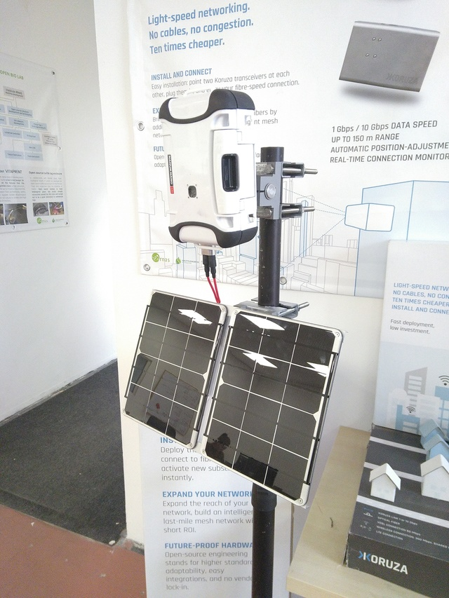

# Arribada Antarctica Monitoring unit user instructions
These user-instructions define the use-case of the device and serve as the guideline for development and creating the software support requirements.

Device consists of:
 * Camera unit:
    * Raspberry Pi Zero W
    * Raspberry Pi camera V2
    * Samsung Evo Plus 64GB microSD card
    * Pira Zero V3
    * 5x 18650 LiPo Cell 2900mAh/4.2V
    * Nanuk 310 waterproof enclosure
    * Multi-directional camera mount
 * Solar power:
    * 2x Voltaic Systems 6V 6W solar panel
    * 2x Voltaic Systems solar panel cable extension
    * Multi-directional solar panel mount
 * Accessories
    * Allen-key tool for mounting
    * SD to microSD adapter
 * Additionally required and not included
  * Pole (round or square) up to 50mm in diameter
  * Metric wrench size 13
  * Compass and tilt measuring device for pointing the solar panels

## Key user features
 * Captures photos and videos in Full HD resolution
 * Configurable time-interval
 * Autonomous operation for 356 days with no charge
 * Adaptive adjustment of capture cycle if extra power is available

## Primary use-case scenario
 * Charge the device from mains power via microUSB connection (up to 24h with 1A 5V USB charger)
 * Configure the preferred capture cycle based on the date for example:
   * month / morning / evening / interval
     * January / sunrise / sunset / 1h
     * February / 05:00 / 18:00 / 30min
     * March / sunrise / 15:00 / 2h
     * April / 12:00 / 13:00 / 1min `unit does not sleep in this case`
 * Deploy the device on-site
   * Connect solar panels
   * Turn the power switch on
   * Turn the debug switch on
   * Unit is on and WiFi appears
     * Recent image seen on web
   * Turn debug switch off, unit then operates normally
 * Unit or microSD card is retrieved/replaced
   * Connect the SD card to Windows and copy images
   * Change or modify the capture cycle or other parameters in config file
